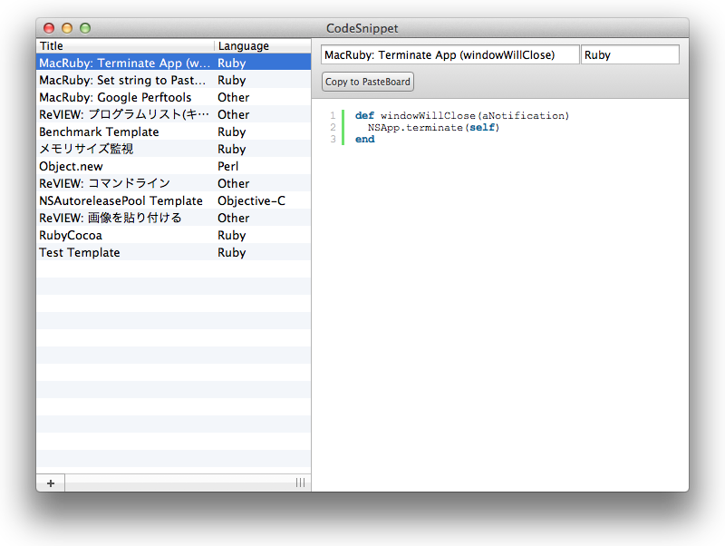

CodeSnippet
===========

CodeSnippet is your code snippet manager. This application is written by MacRuby.

## LICENSE
These works are available under the MIT license. See the [LICENSE](./master/LICENSE "LICENSE") file for more info.
